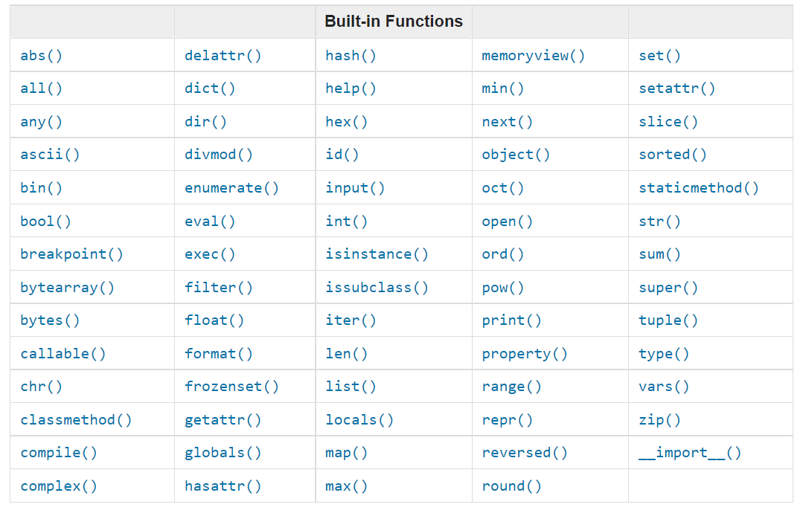

### Number Integer:
- Integer (negative, zero and positive) numbers Example: ... -3, -2, -1, 0, 1, 2, 3 ...
- Float: Decimal number Example ... -3.5, -2.25, -1.0, 0.0, 1.1, 2.2, 3.5 ...
- Complex Example 1 + j, 2 + 4j

### String
- A collection of one or more characters under a single or double quote. If a string is more than one sentence then we use a triple quote.

- `isnumeric()`: checks if all characters in a string are numbers or number related (just like `isdigit()`, just accepts more symbols, like ½)
- `isdigit()`: checks if all characters in a string are numbers (0-9 and some other unicode characters for numbers)
- `isdecimal()`: checks if all characters in a string are decimal (0-9)
- `isalpha()`: checks if all string elements are alphabet characters (a-z and A-Z)
- `isidentifier()`: checks if a string is a valid identifier - a valid variable name
- `islower()`: checks if all alphabet characters in the string are lowercase
- `isupper()`: checks if all alphabet characters in the string are uppercase
- `join(iterable)`: returns a concatenated string, inserting the string as a separator between elements of iterable
- `strip(chars=None)`: removes all given characters (whitespace by default) starting from the beginning and end of the string
- `swapcase()`: converts all uppercase characters to lowercase and all lowercase characters to uppercase characters
- `startswith(prefix)`: checks if the string starts with the specified string
- `title()`: returns a title cased string

### Booleans
- A boolean data type is either a True or False value. T and F should be always uppercase.

### List
- Python list is an ordered collection which allows to store different data type items. Uses `[ ]`.

- Indexing: Exclusive End: The end index is never included, No Errors
    - Positive Indexing (Left-to-Right) Indices: Start at 0 for the first item. Defaults: `start = 0`, `end = len(lst)`, `step = 1`.
        - `lst[1:4]` → Items at index 1, 2, and 3. `lst[:3]` → Items from the beginning up to index 3 (exclusive).
        - `lst[::2]` → Every second item from start to finish.
    - Negative Indexing (Right-to-Left) Indices: The last item is -1, second-to-last is -2. Defaults: Omitted values adapt to match the step direction.
        - `lst[-3:-1]` → Extracts from third-to-last up to (but excluding) the last item.
        - `lst[:-2]` → Extracts everything from the start up to the third-to-last item.
        - `lst[::-1]` → Reverses the entire list.

- `item in list`: "in" operator (not a callable) that checks if an item is a member of a list
- `append(item)`: adds item to the end of an existing list
- `insert(index, item)`: inserts a single item at a specified index in a list. Other items are shifted to the right.
- `remove(item)`: removes the first matching specified item from a list
- `pop(index)`: removes and returns the item at the specified index (or the last item if index is not specified). Unlike `del`, it returns the removed value.
- `del list[index]`: removes the specified index, and can also delete items within an index range or delete the entire list. Does not return anything.
- `clear()`: empties the list, removing all items
- `copy()`: creates and returns a duplicate of the list
- `extend(iterable)`: joins, or concatenates, two lists together (the `+` operator does the same without modifying the original)
- `count(item)`: returns the number of times an item appears in a list
- `index(item)`: returns the index of an item in the list
- `reverse()`: reverses the order of a list in place
- `sort(reverse=False)`: reorders the list items in ascending order and modifies the original list. Pass `reverse=True` to arrange in descending order instead.
- `sorted(iterable)`: returns a new ordered list without modifying the original list

### Dictionary
- A Python dictionary object is an unordered collection of data in a key value pair format.
```
{
    'first name': 'Megan',
    'age': 23,
    'skills': ['Python', 'AI']
}
```
- Keys must be unique and immutable. Uses `{}` with colons separating keys and values.

- `len(dict)`: returns the total number of key: value pairs in the dictionary.
- `get(key, default=None)`: accesses a value safely; returns None or a default value instead of throwing a KeyError if the key is missing.
- `items()`: returns a view object containing the (key, value) pairs as a list of tuples, useful for looping.
- `keys()`: returns a view object of all the keys present in the dictionary.
- `values()`: returns a view object of all the values present in the dictionary.
- `pop(key)`: removes the specified key and returns its corresponding value.
- `popitem()`: removes and returns the last inserted (key, value) pair as a tuple.
- `copy()`: creates and returns a shallow copy of the dictionary.
- `clear()`: removes all elements from the dictionary, leaving it completely empty.
- `del dict[key]`: keyword that completely destroys the specified key (or the whole dictionary variable from memory if used without a key).
- `key in dict`: "in" operator (not a callable) used to check if a specific key (not value) exists within the dictionary.

### Hash Table (dict in Python)
- A **hash** is a mathematical process that takes an input of any size and converts it into a smaller, fixed-size sequence of bytes (called a hash value or hash code). In Python, this is used as a fast indexing system. Instead of searching through data line-by-line, Python converts a key into a hash number to find its exact location in memory instantly.
    - Python dictionaries use this hashing process under the hood to store and look up key-value pairs instantly. Every key must have a value, but they can be any arbitrary data type like numbers or words.
    - You can only hash data types that can never change (immutable). This means strings, numbers, and tuples are allowed, but lists, sets, and dictionaries are forbidden.
    - Hashing is used to secure passwords. While Python uses a global `hash()` function for dictionaries and sets, it includes a built-in `hashlib` module for these cryptographic security functions.
    - **Collision Handling:**
        - Chaining: Store multiple key-value pairs in the same bucket, usually as a list or linked list.
        - Open Addressing / Rehashing: If a collision occurs, find another empty bucket according to some probing method (linear probing, quadratic probing, etc.).
    - Python dictionaries (dict) are implemented as hash maps.
    - You can create a custom hash map (like your HashTable class) to understand how hash maps work internally.

### Tuple
- A tuple is an ordered collection of different data types like list but tuples can not be modified once they are created. They are immutable. Uses `( )`.

- `tuple(iterable)`: creates a tuple (empty if no argument is given)
- `count(item)`: counts the number of times a specified item appears in a tuple
- `index(item)`: finds the index of a specified item in a tuple
- `tuple1 + tuple2`: "+" operator (not a callable) that joins two or more tuples together to create a new tuple
- slicing: same as lists.

- To add an item wherever you want, you can use `+` to add at the end, or slice in the middle where you want it, and `+` both ends:
```python
mytuple = mytuple[:index] + (new_item,) + mytuple[index:]
```
- It's the `(new_item,)` comma that identifies that as a tuple containing 1 item instead of an int.
- We can change tuples to lists and lists to tuples. Tuple is immutable — if we want to modify a tuple we should change it to a list.
- Joining tuples using `+`, no `extend()` because tuples can't be modified.

- `del tuple`: deletes the entire tuple (individual elements cannot be deleted since tuples are immutable)

```python
# Convert the list to a tuple
my_tuple = tuple(my_list)
```

### Set
- A set is a collection of data types similar to list and tuple. Unlike list and tuple, set is not an ordered collection of items. Uses `{ }`.

- `add(item)`: adds a single item to a set; duplicates are ignored without throwing an error
- `update(iterable)`: adds multiple items from an iterable (list, tuple) into a set
- `remove(item)`: deletes a specific item from a set; throws an error if the item is not found
- `discard(item)`: deletes a specific item from a set; does not throw an error if the item is not found
- `pop()`: removes and returns a random item from the set
- `clear()`: empties the set entirely
- `del set`: deletes the set variable completely from memory
- `set(iterable)`: converts a list, string, or tuple into a set of unique elements
- `union(other_set)`: joins sets together, returning a new set with all unique elements from both
- `intersection(other_set)`: returns a new set containing only the items that exist in both sets
- `intersection_update(other_set)`: modifies the original set to keep only the items found in both sets
- `issubset(other_set)`: checks if all elements of the current set belong to another set
- `issuperset(other_set)`: checks if the current set contains all elements of another smaller collection
- `difference(other_set)`: returns a new set with elements in the first set that are not in the second
- `symmetric_difference(other_set)`: returns a new set with all items across both sets, minus the items they share in both
- `isdisjoint(other_set)`: checks if two sets share zero elements, returning True if they do not overlap at all



### String Formatting
- `%s` - String (or any object with a string representation, like numbers)
- `%d` - Integers
- `%f` - Floating point numbers
- `"%.<number of digits>f"` - Floating point numbers with fixed precision

### For loops
- `break`: keyword (not a callable, no parentheses/args) that stops the loop before it is completed
- `continue`: keyword (not a callable, no parentheses/args) that skips the rest of the current iteration and moves to the next one
- `range(start, stop, step)`: returns a sequence of numbers. Takes three parameters: starting, ending and increment. By default it starts from 0 and the increment is 1. The range sequence needs at least 1 argument (stop). stop is non-inclusive.
- `pass`: keyword (not a callable, no parentheses/args) used on empty for loops (or other empty blocks) to avoid errors

### Built-in Functions & Higher Order Functions (work with any iterable — list, tuple, string, set, dict — not tied to one data type)
- `lambda args: expr`: keyword syntax (not a callable) that creates an inline anonymous function, e.g. used inside `filter()`, `map()`, or `sorted()`. Example: `add_ten = lambda x: x + 10`
- `enumerate(iterable, start=0)`: returns an iterator of (index, item) pairs, useful for looping when you need both the index and the value
- `zip(*iterables)`: combines multiple iterables element-wise into an iterator of tuples, stopping as soon as the shortest iterable is exhausted
- `any(iterable)`: returns True if at least one element in the iterable is truthy (returns False on an empty iterable)
- `all(iterable)`: returns True if every element in the iterable is truthy (returns True on an empty iterable)
- A higher order function is a function that accepts another function or returns another function. Built in higher order functions (`map()`, `filter()`, `reduce()`, `sorted()`)
- Decorator: A design pattern in Python that allows a user to add new functionality to an existing object without modifying its structure. Decorators are usually called before the definition of a function you want to decorate.
    - you use decorators for code reusability. write the wrapper logic once and apply it to ten functions using a single line.
    - checks if users logged in before letting the see a profile page `@login_required`
    - can be used to cache results easily and it just kind of adds another funtion to whats already going to run `@lru_cache`
- Closures: Python allows a nested function to access the outer scope of the enclosing function. This is is known as a Closure. Let us have a look at how closures work in Python. In Python, closure is created by nesting a function inside another encapsulating function and then returning the inner function. See the example below.
- `filter(function, iterable)`: extracts elements from an iterable based on whether they meet a specific condition. Returns a lazy generator object, not a finished list or string — convert it into a concrete data type using `list()`, `tuple()`, or `"".join()`
    - makes a boolean for each item in iterable and only returns the true
- `map(function, iterable)`: applies a function to every item in an iterable, returning a lazy iterator of the results (like `filter()`, convert it with `list()`, `tuple()`, etc. to see the values)
    - Why it matters: It computes values on demand instead of loading everything into memory at once.
    - Example: If you have 10 million items, map() consumes almost zero memory upfront, whereas a list comprehension will instantly allocate memory for all 10 million elements.
- `reduce(function, iterable)`: Function is defined in the functools module and we should import it from this module. Like `map()` and `filter()` it takes two parameters, a function and an iterable. However, it does not return another iterable, instead it returns a single value.
- `sorted(interable, key)`: key uses lambda function


### Modules
- OS Module: performing operating systme tasks, creating, changing working dir, removing a dir/folder, fetching contents, etc.
- Sys Module: functions and variables to manipluate diff parts of Python runtime env. Function sys.argv returns a list of command line args passed into a Python script. Item at index 0 is always the name of the script, item 1 is the arg passed in from command line.
    - #print(sys.argv[0], argv[1],sys.argv[2])  # this line would print out: filename argument1 argument2
- Statistics: Math stats functions for numerical data. mean, median, mode, stdev, etc.
- Math Module: Mathematic operations and constants. pi, sqrt, power, floor, ceil, log10,etc. To check what functions the module has got, we can use help(math), or dir(math). This will display the available functions in the module. If we want to import only a specific function from the module we import it as follows:
    - from math import pi, sqrt
- String Module: ascii_letters returns alphabeticals, .digits, .punctuation, .hexadecimal, etc.
- Random Module: 
    - `random.random()` gives us a random float between 0-0.9999. 
    - `randint(a, b)` gives us a random integer between a and b inclusive. 
    - `choice(seq)` returns a single random item from a sequence. 
    - `choices(population, k=n)` returns a list of n random items, with replacement (duplicates allowed). 
    - `sample(population, k=n)` returns a list of n unique random items, without replacement (no duplicates).

### Packing and Unpacking Arguments in Python
- * for tuples
- ** for dictionaries
- Let us take as an example below. It takes only arguments but we have list. We can unpack the list and changes to argument.

### ReGex Expressions
- A regular expression or RegEx is a special text string that helps to find patterns in data. A RegEx can be used to check if some pattern exists in a different data type. 
    - `re.match()`: searches only in the beginning of the first line of the string and returns matched objects if found, else returns None.
    - `re.search`: Returns a match object if there is one anywhere in the string, including multiline strings.
    - `re.findall`: l: Returns a list containing all matches
    - `re.split`: Takes a string, splits it at the match points, returns a list
    - `re.sub`: Replaces one or many matches within a string
- Writing RegEx Patterns
    - To declare a string variable we use a single or double quote. To declare RegEx variable r''. The following pattern only identifies apple with lowercase, to make it case insensitive either we should rewrite our pattern or we should add a flag.
    - Why the r Prefix Matters: 
        - Raw strings: The r tells Python to treat backslashes like normal text instead of special escape codes. For simple text like 'apple', nothing changes. However, when you use common regex symbols like \d, \w, or \b, leaving out the r will break your code or cause unexpected behavior.
        - No backslashes here: Your pattern 'apple' does not use backslashes (like \n or \t), so Python reads it the exact same way with or without the r.
    - []: A set of characters
        - [a-c] means, a or b or c
        - [a-z] means, any letter from a to z
        - [A-Z] means, any character from A to Z
        - [0-3] means, 0 or 1 or 2 or 3
        - [0-9] means any number from 0 to 9
        - [A-Za-z0-9] any single character, that is a to z, A to Z or 0 to 9
    - \: uses to escape special characters
        - \w: Matches any word character (letters a-z, A-Z, numbers 0-9, and underscore _).
        - \W: Matches any non-word character (the opposite of \w, like spaces, symbols, or punctuation).
        - \b: Matches a word boundary (an invisible anchor point between a word character and a non-word character or string edge).
        - \B: Matches a non-word boundary (any spot where \b does not fit).
        - \d: Matches any digit (numbers from 0 to 9).
        - \D: Matches any non-digit character.
        - \s: Matches any whitespace character (spaces, tabs, and line breaks).
        - \S: Matches any non-whitespace character.
    - . : any character except new line character(\n)
    - ^: starts with
        - r'^substring' eg r'^love', a sentence that starts with a word love
        - r'[^abc] means not a, not b, not c.
    - $: ends with
        - r'substring$' eg r'love$', sentence that ends with a word love
    - *: zero or more times
        - r'[a]*' means a optional or it can occur many times.
    - +: one or more times
        - r'[a]+' means at least once (or more)
    - ?: zero or one time
        - r'[a]?' means zero times or once
    - {3}: Exactly 3 characters
    - {3,}: At least 3 characters
    - {3,8}: 3 to 8 characters
    - |: Either or
        - r'apple|banana' means either apple or a banana
    - (): Capture and group

### File Handling
- If you do not close a text file in Python, you risk data loss, file corruption, resource leaks, and file locking issues!
    - There is a new way of opening files using `with` - closes the files by itself.
- Text file handling: 
    -   Opened file has different reading methods: read(), readline, readlines.
        - read(): read the whole text as string. If we want to limit the number of characters we want to read, we can limit it by passing int value to the read(number) method.
        - readline(): read only the first line
        - readlines(): read all the text line by line and returns a list of lines
        - splitlines(): get all the lines as a list
    - open('filename', mode) # mode(r, a, w, x, t,b)  could be to read, write, update
        - "r" - Read - Default value. Opens a file for reading, it returns an error if the file does not exist
        - "r+" - Read and Write mode.  Starts at the beginning, but leaves old text if the new text is shorter unless you clear it first
        - "a" - Append - Opens a file for appending, creates the file if it does not exist
        - "w" - Write - Opens a file for writing, creates the file if it does not exist. Erases all old content when opening, then writes new text from the start
        - "x" - Create - Creates the specified file, returns an error if the file exists
        - "t" - Text - Default value. Text mode
        - "b" - Binary - Binary mode (e.g. images)
        - Modes can be combined, e.g. "rb" (read binary), "a+" (append and read), "w+" (write and read)
    - Writing methods:
        - write(string): writes a single string to the file (does not add a newline automatically, add `\n` yourself)
        - writelines(list): writes a list of strings to the file, one after another (no automatic newlines either)
    - An opened file has to be closed with close() method, otherwise changes may not be saved and the file stays locked.
    - `with` statement (context manager): preferred way to open files, since it closes the file automatically even if an error occurs.
        - `with open('filename', 'r') as f: data = f.read()` -> no need to call f.close()
    - seek(offset) / tell(): seek() moves the file pointer (cursor) to a byte position, tell() returns the current cursor position.
    - Encoding: pass `encoding='utf-8'` to open() to avoid errors with special characters, especially on Windows.
    - Checking if a file exists: `os.path.exists('filepath')` or `os.path.isfile('filepath')` (from the os module) before reading/deleting, to avoid errors.
    - Handling missing files: opening a non-existent file in "r" mode raises `FileNotFoundError` - can wrap in try/except.
    - Deleting files: using os module `os.remove('filepath')` - raises `FileNotFoundError` if the file doesn't exist, so check with os.path.exists() first or catch the exception.
    - Deleting folders: `os.rmdir('folder')` for an empty folder, `shutil.rmtree('folder')` (from the shutil module) to delete a folder and everything inside it.
- JSON Datafile handling: convert JSON to a dictionary
    - Changing JSON to Dictionary: Import  and use `loads` method -> output dict type with data.
    - Changing Dictionary to JSON: we use `dumps` method from the json module. (str type instead of dct)
    - Saving as JSON File: For writing a json file, we use the json.dump() method, it can take dictionary, output file, ensure_ascii and indent.
    - Reading a JSON File: `json.load(f)` reads directly from an open file object and returns a dict (no need to read() the text first).
        - Note the naming pattern: `load`/`dump` work with file objects, `loads`/`dumps` (the "s" = string) work with strings already in memory.
- CSV Datafile handling: CSV is a simple file format used to store tabular data, such as a spreadsheet or database. 
    - `csv_reader = csv.reader(f, delimiter=',')` we use, reader method to read csv - each row comes back as a list of strings.
    - `csv_writer = csv.writer(f)` writes rows to a csv file - `csv_writer.writerow(list)` for one row, `csv_writer.writerows(list_of_lists)` for many.
    - `csv.DictReader(f)` reads each row as a dictionary, using the first row as the keys (column headers) by default.
    - `csv.DictWriter(f, fieldnames=[...])` writes dictionaries as rows - call `.writeheader()` first to write the column names, then `.writerow(dict)`.
    - When opening a csv file for writing, use `open('file.csv', 'w', newline='')` - the `newline=''` avoids extra blank lines being inserted on Windows.
- XLSX Datafile handling: Excel spreadsheet format - unlike json/csv, it's not in the standard library, needs a package like `openpyxl` (`pip install openpyxl`) or `pandas`.
    - Reading with openpyxl: `wb = openpyxl.load_workbook('file.xlsx')` loads the workbook, `wb.sheetnames` lists the sheets, `sheet = wb['Sheet1']` (or `wb.active` for the default sheet) selects one.
    - Reading cells: `sheet['A1'].value` reads a single cell, `sheet.iter_rows(values_only=True)` loops through all rows as tuples of values.
    - Writing with openpyxl: `wb = openpyxl.Workbook()` creates a new workbook, `sheet.append([...])` adds a row, `wb.save('file.xlsx')` saves it to disk.
    - Reading/writing with pandas: `df = pandas.read_excel('file.xlsx')` reads a sheet straight into a DataFrame; `df.to_excel('file.xlsx', index=False)` writes one back out. Handy when the data needs analysis/manipulation rather than just storage.

### PIP & Package Manager
- `pip install`
- `pip uninstall`
- `pip list`: See the installed packages on our machine
- `pip show [--verbose] packagename`: To show information about a package
- `pip freeze`: Generate installed Python packages with their version and the output is suitable to use it in a requirements file. A requirements.txt file is a file that should contain all the installed Python packages in a Python project.
- `pip install requests`: Read from a website using url or from an API. To open a network connection, we need a package called requests - it allows to open a network connection and to implement CRUD(create, read, update and delete) operations.
    - get(): to open a network and fetch data from url - it returns a response object
    - status_code: After we fetched data, we can check the status of the operation (success, error, etc)
    - headers: To check the header types
    - text: to extract the text from the fetched response object
    - json: to extract json data
- `__init__`: If we put init.py in a self made package/folder, python start recognizes it as a package. The init.py exposes specified resources from its modules to be imported to other python files. An empty init.py file makes all functions available when a package is imported. The init.py is essential for the folder to be recognized by Python as a package.
- Common Packages:
    - Database
        - SQLAlchemy or SQLObject - Object oriented access to several different database systems
    - Web Development
        - Django - High-level web framework.
        - Flask - micro framework for Python based on Werkzeug, Jinja 2. (It's BSD licensed)
    - HTML Parser
        - BeautifulSoup4 - HTML/XML parser designed for quick turnaround projects like screen-scraping, will accept bad markup.
        - PyQuery - implements jQuery in Python; faster than BeautifulSoup, apparently.
    - XML Processing
        - ElementTree - The Element type is a simple but flexible container object, designed to store hierarchical data structures, such as simplified XML infosets, in memory. --Note: Python 2.5 and up has ElementTree in the Standard Library
    - GUI
        - PyQt - Bindings for the cross-platform Qt framework.
        - TkInter - The traditional Python user interface toolkit.
    - Data Analysis, Data Science and Machine learning
        - Numpy: Numpy(numeric python) is known as one of the most popular machine learning library in Python.
        - Pandas: is a data analysis, data science and a machine learning library in Python that provides data structures of high-level and a wide variety of tools for analysis.
        - SciPy: SciPy is a machine learning library for application developers and engineers. SciPy library contains modules for optimization, linear algebra, integration, image processing, and statistics.
        - Scikit-Learn: It is NumPy and SciPy. It is considered as one of the best libraries for working with complex data.
        - TensorFlow: is a machine learning library built by Google.
        - Keras: is considered as one of the coolest machine learning libraries in Python. It provides an easier mechanism to express neural networks. Keras also provides some of the best utilities for compiling models, processing data-sets, visualization of graphs, and much more.
    - Network:
        - requests: is a package which we can use to send requests to a server(GET, POST, DELETE, PUT)

## Classes & Objects / OOP
- Python itslef is an object oriented programming language. Everything in Python is an object, with its properties and methods. A number, string, list, dictionary, tuple, set etc. used in a program is an object of a corresponding built-in class. We create class to create an object. A class is like an object constructor, or a "blueprint" for creating objects. We instantiate a class to create an object. The class defines attributes and the behavior of the object, while the object, on the other hand, represents the class.
- Constructor: Python has also a built-in init() constructor function. The init constructor function has self parameter which is a reference to the current instance of the class
- Object methods: Objects can have methods. The methods are functions which belong to the object.
- Object Default Methods: Sometimes, you may want to have default values for your object methods. If we give default values for the parameters in the constructor, we can avoid errors when we call or instantiate our class without parameters.
- Inheritence: reuse parent class code. Inheritance allows us to define a class that inherits all the methods and properties from parent class. The parent class or super or base class is the class which gives all the methods and properties. Child class is the class that inherits from another or parent class. 

### Web Scraping
- To scrape websites you use requests, beautifoulSoup4 and a website. Basic understanding of HTML tags and CSS selectors is needed.